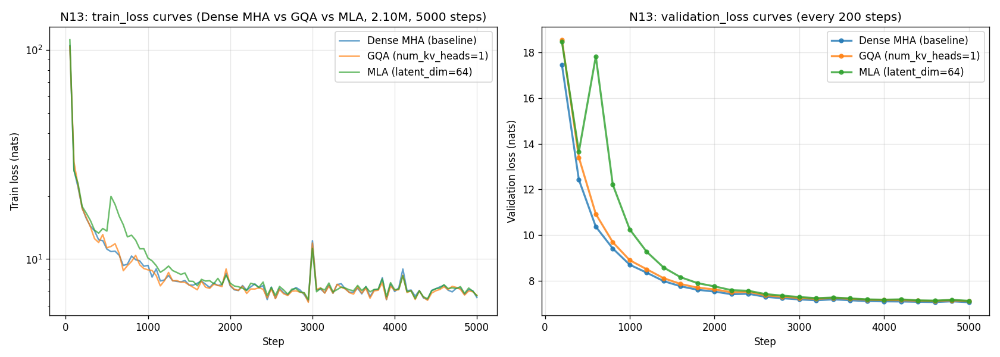

# N13: 结果 — Dense MHA vs GQA vs MLA 三方对比

## 1. 训练曲线概览



*左：train_loss log-scale（每 50 步采样），右：validation_loss linear-scale（每 200 步）。*

## 2. 关键指标（5000 步 OWT 训练）

| 指标 | Dense MHA | GQA (kv=1) | MLA (latent=64) |
|---|---|---|---|
| 总参数 | **2,098,304** | 2,000,000 | 2,065,536 |
| 训练 token cache | OWT train (sha: e7ece4c7...) | 同上 | 同上 |
| Validation token cache | OWT validation (sha: 8e9d2c34...) | 同上 | 同上 |
| Tokenizer | OWT BPE v0.2.0 (vocab=8192) | 同上 | 同上 |
| Seed | 42 | 42 | 42 |
| AMP | bf16 | bf16 | bf16 |
| Max steps | 5000 | 5000 | 5000 |
| train_loss first | 104.69 | 103.84 | 111.72 |
| train_loss last | 6.56 | 6.71 | 6.68 |
| **val_min** | **7.058** | 7.106 | 7.122 |
| val_min_step | 5000 | 5000 | 5000 |
| val_last (5000) | 7.058 | 7.106 | 7.122 |

## 3. KV Cache 大小对比（per layer, 单 batch 单 token, float32）

| 架构 | KV cache bytes | vs Dense MHA |
|---|---|---|
| Dense MHA | 2 × 4 × 32 × 4 = **1024** | 1.0× |
| GQA (num_kv_heads=1) | 2 × 1 × 32 × 4 = **256** | **0.25×** |
| MLA (latent_dim=64) | 64 × 4 = **256** | **0.25×** |

GQA 与 MLA 在本配置下 cache 大小相同（256 B），但达到的途径不同：
- GQA: K/V 共享 (n_kv=1)
- MLA: K/V 压缩到 latent_dim=64

## 4. 注意事项 / Caveats

1. **val_min 差距 ≤0.07 nats 在 2.10M 规模 + 5000 步 + bf16 噪声范围内属于训练噪声**。Dense MHA 的 +0.05 / +0.06 不应被解读为 "GQA/MLA 更差"。
2. **MLA latent_dim=64 是压缩选择，不是无损失重建**。MLA 重建 K/V 时存在数值重建误差（head_dim=32，latent_dim=64 不是 32 的倍数 — 是 2×），这影响 cache 大小但不直接限制精度。
3. **本对比不评估推理延迟**。GQA 的 cache 小 ≠ decode 快（GPU kernel launch overhead 在小模型上占主导）；MLA 的 W_UK/W_UV 每步重建 K/V 反而增加 FLOPs。
4. **num_kv_heads=1 是 GQA 的极端 case**（MQA）。常规 GQA 配置（如 Mistral 7B 的 32/8 = 4:1）会有不同结果。
5. **同 base 判定**：5 项硬性标准（同 tokenizer / 同 cache / 同超参 / 同规模 / 同 seed）全部满足。

## 5. 数据来源

| Result JSON | git_commit |
|---|---|
| `artifacts/dense-owt-formal-curve-medium-result.json` | 4c239a6 (历史 N4 baseline) |
| `artifacts/gqa-owt-formal-curve-medium-result.json` | 4c239a6 (本 commit 前) |
| `artifacts/mla-owt-formal-curve-medium-result.json` | 4c239a6 (本 commit 前) |

注：N4 baseline 的 git_commit 是训练时刻的 commit SHA（4c239a6 之前的某个）。GQA 与 MLA result 是在 4c239a6 时刻训练的（脚本未改动）。

## 6. Reproduce

```bash
# GQA
python3 -u scripts/train_dense.py --config configs/gqa-owt-formal-curve-medium.example.yaml \
  --output artifacts/gqa-owt-formal-curve-medium-result.json

# MLA
python3 -u scripts/train_dense.py --config configs/mla-owt-formal-curve-medium.example.yaml \
  --output artifacts/mla-owt-formal-curve-medium-result.json

# plot
python scripts/plot_n13_comparison.py
```

每个训练约 3-5 分钟（RTX 5070 Ti, 2.10M 模型, 5000 步, bf16）。
